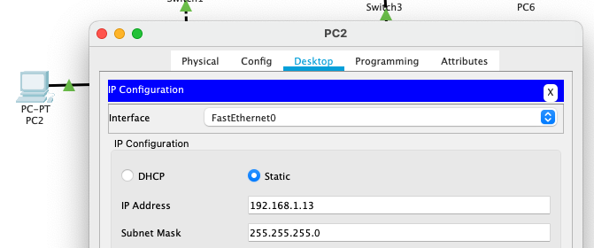

University: ITMO University

Faculty: FICT

Course: IP-Telephony

Year: 2023/2024

Group: K34212

Author: Glebov Ivan Igorevich

Lab: Lab1

Date of create: 5.03.2024

Date of finished: 5.02.2024

# Лабораторная работа №1 "Базовая настройка ip-телефонов в среде Cisco Packet Tracer"

### Цель

Изучить рабочую среду Cisco Packet Tracer, ознакомить- ся с интерфейсами основных устройств, типами кабелей, научиться собирать топологию. Изучить построение сети IP-телефонии с помощью маршрутизатора, коммутатора и IP телефонов Cisco 7960 в среде Packet tracer

### Часть 1

В первой части надо было создать схему из 4-х свитчей и по 2 ПК у каждого, которая представлена ниже:


Для каждого из ПК в конфигурации задаётся адрес IPv4 из выбранной подсети. В данном случае 192.168.1.0/24.



После назначения устройствам IPv4 адресов можно проверить связность сети выполнив команду ping между ПК.


### Часть 2

На этом этапе надо создать простую сеть из 2-х IP-телефонов, коммутатора и маршрутизатора.

Схема представлена ниже


Чтобы все телефоны включились надо в их конфигурации подключить питание, так как из коробки они идут без него.

Сразу обновим hostname роутера командой hostname CMER из режима конфигурации терминала (-> enable -> configure terminal)

После этого проставим на интерфейс смотрящий в сторону коммутатора IPv4 адрес следующей чередой команд:

```cisco
(config) #ip interface fa0/0
(config-ig) #ip address 192.168.0.1 255.255.255.0
```

Добавим на маршрутизатор DHCP-сервер для IP-телефонов следующей чередой команд:

```cisco
(config) #ip dhcp pool phones
(dhcp-config) #network 192.168.0.0 255.255.255.0
(dhcp-config) #default router 192.168.0.1
(dhcp-config) #option 150 ip 192.168.0.1
(dhcp-config) #exit
(config) #ip dhcp excluded-address 192.168.0.1
```

Теперь настроим сервис телефонии следующей чередой команд:

```cisco
(config) #telephony-service
(config-telephony) #max-dn 10
(config-telephony) #max-ephones 10
(config-telephony) #ip source-address 192.168.0.1 port 3100
```

Добавим на роутер телефоны и выдадим им адреса:

```cisco
(config) #ephone-dn 1
(config-ephone-dn) #number 111
(config-ephone-dn) #ephone 2
(config-ephone-dn) #number 222
```

После этой команды мы закончили настройку маршрутизатора и можем приступать к настройке коммутатора. Она заключается в том, что необходимо на все подключённые порты выдать режим access и указать, что voice vlan - 1. Для этого надо выполнить следующую последовательность команд:

```cisco
(config) #interface range fa0/1-fa0/3
(config-if-range) #switchport mode access
(config-if-range) #switchport voice vlan 1
```

Подключенные телефоны представлены на рисунках ниже


### Вывод

В ходе выполнения лабораторной работы мы изучили построение сети IP-телефонии с помощью маршрутизатора, коммутатора и IP телефонов Cisco 7960 в среде Packet tracer. Создали и настроили две схемы сети в Cisco Packet Tracer. Первая сеть, состоящая из коммутаторов и ПК. Вторая сеть, состоящая из ip-телефонов, маршрутизатора и коммутатора. В результате были освоены базовые принципы работы ip-телефонии на примере настройки ip-телефонов Cisco.
