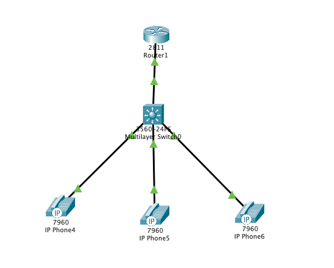
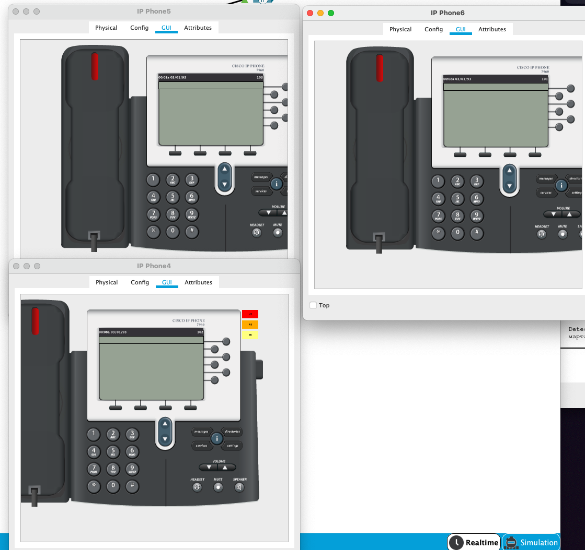
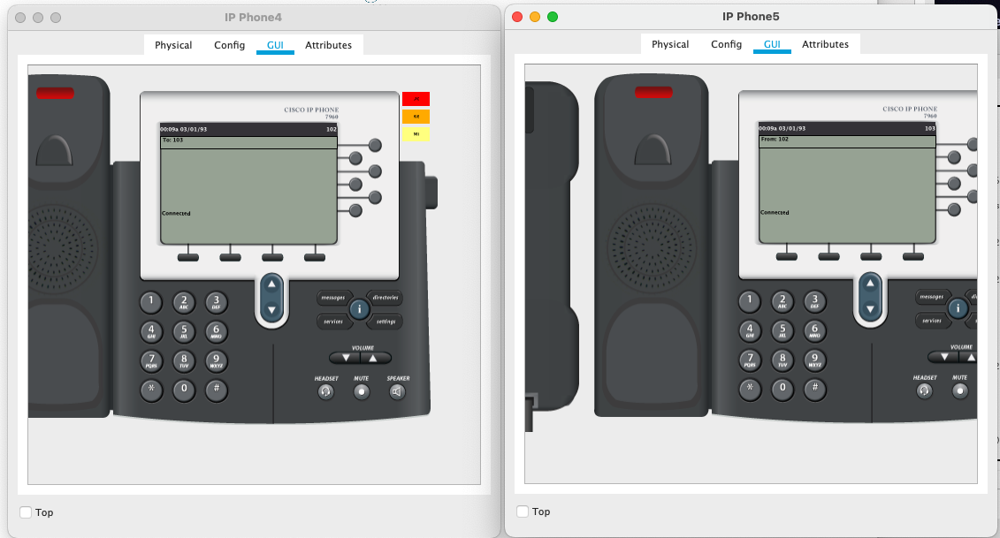
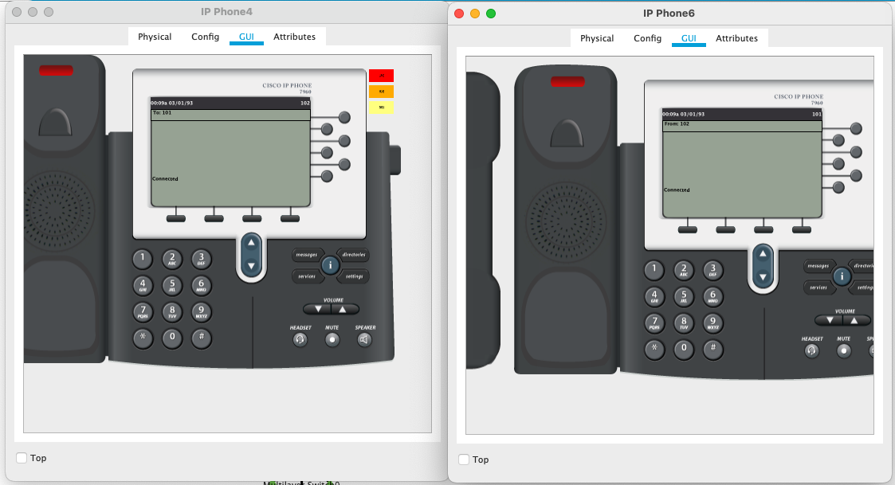
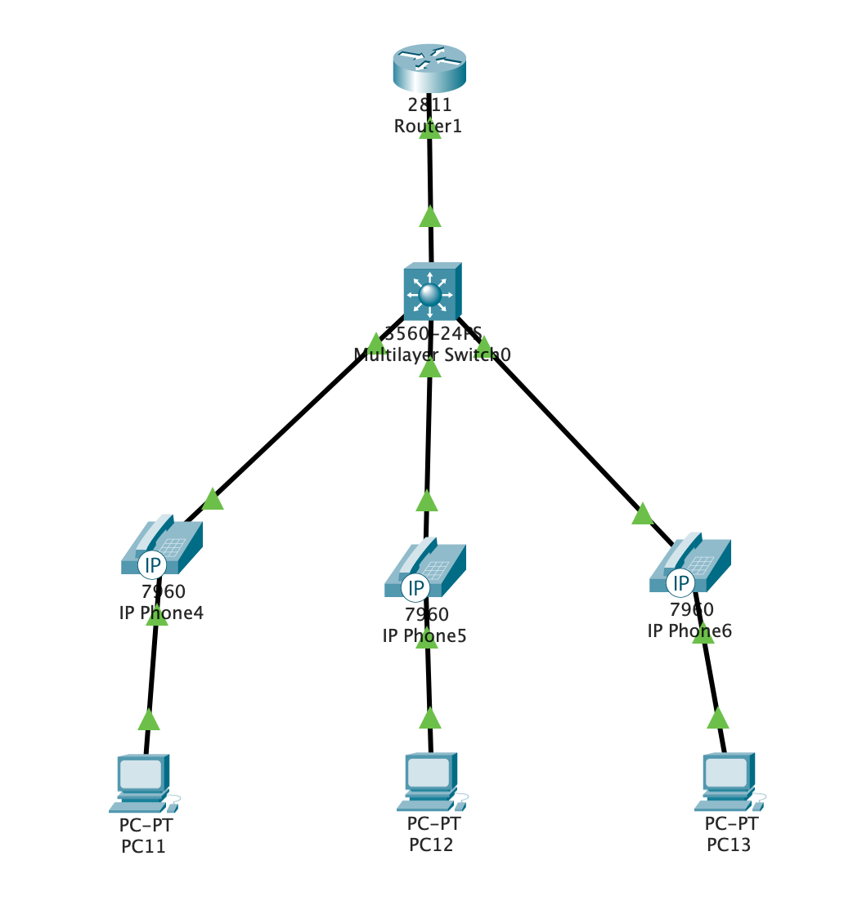
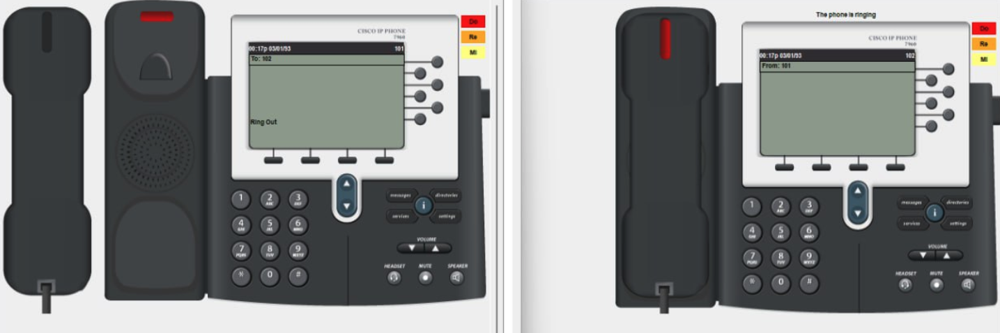

University: ITMO University

Faculty: FICT

Course: IP-Telephony

Year: 2023/2024

Group: K34212

Author: Glebov Ivan Igorevich

Lab: Lab2

Date of create: 7.03.2024

Date of finished: 9.03.2024

# Лабораторая работа №2 "Конфигурация voip в среде Cisco Packet Tracer"

### Цель

Изучить построение сети IP-телефонии с помощью маршрутизатора Cisco 2811, коммутатора Cisco catalyst 3560 и IP телефонов Cisco 7960.

### Часть 1

В первой части лабораторной надо было собрать сеть из 3-х ip-телефонов, одного L3 коммутатора и маршрутизатора Cisco 2811. Схема представлена на рисунке ниже.



Конфигурация маршрутизатора и коммутатора на первом этапе не отличаются от конфигурации в Лабораторной работе 1. По этой причине подробное описание команд конфигурации приводиться не будет.

#### Конфигурация маршрутизатора Cisco 2811

```cisco
(config) #hostname CMER
(config) #int fa0/0
(config-if) #ip address 192.168.10.1 255.255.255.0
(config-if) #no shutdown
(config-if) #exit
(config) #ip dhcp pool phones
(dhcp-config) #network 192.168.10.0 255.255.255.0
(dhcp-config) #default-router 192.168.10.1
(dhcp-config) #option 150 ip 192.168.10.1
(dhcp-config) #exit
(config) #telephony-service
(config-telephony) #max-dn 5
(config-telephony) #max-ephones 5
(config-telephony) #ip source-address 192.168.10.1 port 2000
(config-telephony) #auto-assign 1 to 5
(config-telephony) #exit
(config) #ephone-dn 1
(config-ephone-dn) #number 101
(config-ephone-dn) #ephone-dn 2
(config-ephone-dn) #number 102
(config-ephone-dn) #ephone-dn 3
(config-ephone-dn) #number 103
(config-ephone-dn) #end
#write memory
```

#### Конфигурация L3 коммутатора

```cisco
(config) #interface range fa0/1-4
(config-it-range) #switchport mode access
(config-it-range) #switchport void vlan 1
(config-it-range) #end
#write memory
```

На этом этапе первичная конфигурация устройств закончена и можно проверять их связность между собой. Скрины проверки представлены ниже.





### Часть 2

В схему из части 1 надо добавить 3 пользовательских компьютера, которые будут подключены через телефоны. Обновлённая схема представлена на рисунке ниже:



Для работы компьютеров и телефонов одновременно надо немного подправить конфигурацию. Начать надо с маршрутизатора и дальше настроить коммутатор. В данном случае надо на маршрутизаторе убрать часть конфигурации связанной с интерфейсом fa0/0, так как на нём будут настраиваться виртуальные интерфейсы и адреса соответствующих Vlan будут прокидываться именно туда. Для этого надо зайдя в настройки интерфейса прописать команду `no ip address 192.168.10.1 255.255.255.0`. После этого лучше выключить интерфейс командой `shutdown`.

Дальнейшая настройка представляет собой создание виртуальных интерфейсов и конфигурацию дополнительного dhcp-pool. Ниже будет приведена часть конфигурации. Дополнительно создан vlan 99 вместо стандартного vlan 1 для управления коммутаторами и маршрутизаторами в сети. Это является избыточным для текущей лабораторной, но в реальной сети является хорошей практикой.

```cisco
(config) #interface fa0/0.10
(config-subif) #encapsulation dot1Q 10
(config-subif) #ip address 192.168.10.1 255.255.255.0
(config-subif) #no shutdown
... repeat for 20 and 99
(config-subif) #exit
(config) #int fa0/0
(config-if) #no shutddown
(config-if) #exit
(config) #ip dhcp pool data
(dhcp-config) #network 192.168.20.0 255.255.255.0
(dhcp-config) #default-router 192.168.20.1
(dhcp-config) #exit
(config) #ip dhcp excluded-address 192.168.20.1
(config) #ip dhcp excluded-address 192.168.10.1
(config) #ip dhcp excluded-address 192.168.99.1
(config) #end
#write memory
```

Конфигурация коммутатора

```cisco
(config) #vlan 10
(config-vlan) #vlan 20
(config-vlan) #vlan 30
(config-vlan) #exit
(config) #interface vlan 10
(config-if) #no shutdown
(config-if) #interface vlan 20
(config-if) #no shutdown
(config-if) #interface vlan 99
(config-if) #ip address 192.168.99.10 255.255.255.0
(config-if) #no shutdown
(config-if) #int range fa0/2-4
(config-if-range) #switchport mode access
(config-if-range) #switchport access vlan 20
(config-if-range) #int fa0/1
(config-if) #switchport mode trunk
(config-if) #switchport trunk allowed vlan all
(config-if) #end
#write memory
```

После выполнения команд на соответствующих устройствах у нас появляется сеть в которой работает ip-телефония и имеется связность между компьютерами. Демонстрация работы ip-телефонии представлена на рисунке ниже:


