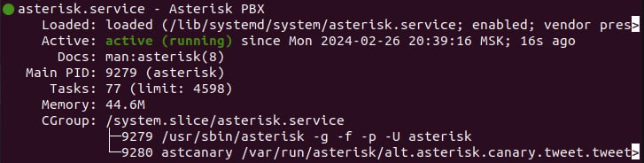
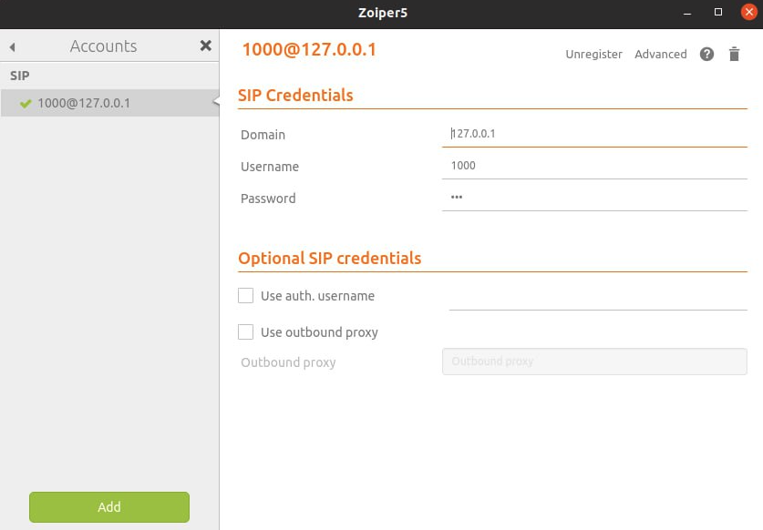
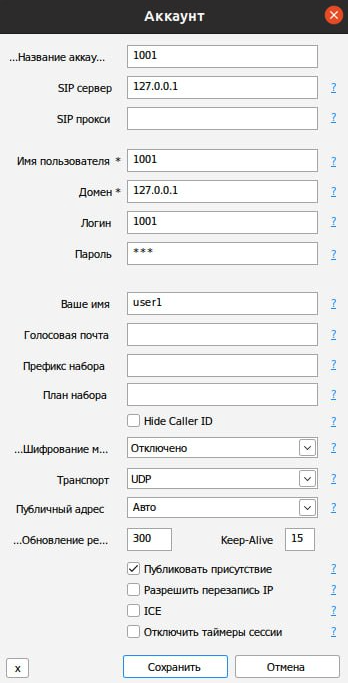
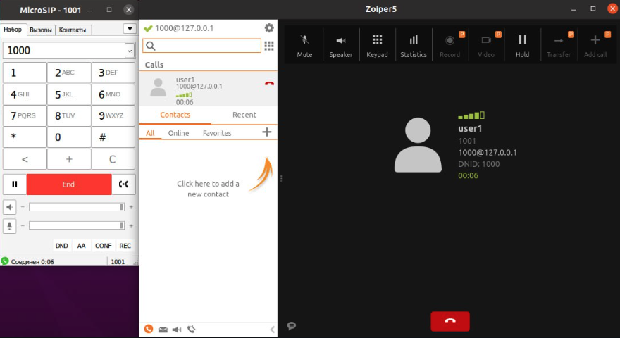

University: ITMO University

Faculty: FICT

Course: IP-Telephony

Year: 2023/2024

Group: K34212

Author: Glebov Ivan Igorevich

Lab: Lab3

Date of create: 9.03.2024

Date of finished: 9.03.2024

### Цель работы

Изучить программный комплекс Asterisk. Настройка Asterisk для локальных звонков.

## Ход работы

Перед выполнением работы выполнена установка виртуальной машины Ubuntu внутри VirtualBox, так как отсутствует железный хост с системой.

На Ubuntu был установлен Asterisk командой `sudo apt-get install asterisk`.

Далее в директории `/etc/asterisk` был открыт файл `sip.conf`, куда была добавлена информация о телефонах 1000 и 1001. Тип `friend` (для совершения и принятия вызовов), разрешение подключения с разных IP-адресов, пароль и имя контекста

```conf
[1000]
type=friend
host=dynamic
secret=123
context=ext_1000

[1001]
type=friend
host=dynamic
secret=123
context=ext_1001
```

В файл extensions.conf были определены екстеншены в указанных ранее контекстах:
вызов должен осуществляться по введенному номеру, тип канала – SIP

```conf
[ext_1000]
exten => _XXXX,1,Dial(SIP/${EXTEN})

[ext_1001]
exten => _XXXX,1,Dial(SIP/${EXTEN})
```

После измененя файлов Asterisk был перезапущен для вступления в силу изменений командой `sudo service asterisk restart`. Статус сервиса был проверен, как видно он был успешно запущен:



Далее были установлены софтфоны Zoiper5 и MicroSIP. Так как работа выполнялась на Ubuntu нужно было также установить wine, настроить и с помощью него уже установить MicroSIP.

Далее софтфоны были подключены: введены указанные ранее номера и пароли, а также адрес сервера – адрес текущего хоста 127.0.0.1.
Настройка Zoiper5:



Настройка MicroSIP:



Для проверки успешной настройки связи был совершен звонок на телефон 1000 с телефона 1001. Как видно, соединение было установлено, на экране виден номер звонящего телефона:



### Вывод

В ходе лабораторной работы был настроен Asterisk для локальных звонков, в результате чего успешно установлена связь между софтфонами.
